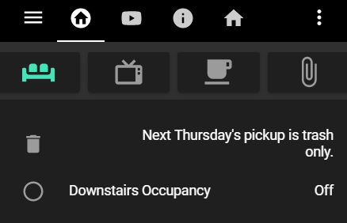

# Home Assistant Swipe Navigation

[](https://github.com/hacs/integration)

Swipe through Home Assistant Dashboard views on mobile.



This repository has been forked from [maykar/lovelace-swipe-navigation](https://github.com/maykar/lovelace-swipe-navigation) to continue the development since the original project seems to be currently unmaintained.

💡 **Please uninstall [maykar/lovelace-swipe-navigation](https://github.com/maykar/lovelace-swipe-navigation) before proceeding, as they will likely conflict.**

## Features:
* Animated swiping through Dashboard views.
* Configure views to skip over.
* Set the swipe length needed.
* Option to disable a browsers default swipe actions.
* Wrap from first view to last view and vice versa.
* Support RTL languages.
* Option to ignore swipes over certain elements (e.g. sliders or maps).

## Installation:
**Follow only one of these installation methods.**

<details>
  <summary><b>Installation and tracking with HACS:</b></summary>

1. In "Frontend" hit the plus button at the bottom right, search for "swipe navigation", and install.

2. Refresh the Dashboard page. You might need to clear the cache.
</details>

<details>
  <summary><b>Manual installation:</b></summary>
  
1. Copy [swipe-navigation.js](https://github.com/zanna-37/hass-swipe-navigation/releases/latest) from the latest release into `/www/hass-swipe-navigation/`

2. Add the resource in `ui-lovelace.yaml` or in Dashboard Resources.

```yaml
resources:
  # increase this version number at end of URL after each update
  - url: /local/hass-swipe-navigation/swipe-navigation.js?v=1.0.0
    type: module
```

3. Refresh the page, may need to clear cache.
</details>

## Config:
**If you just want to use the default config values you don't need to add a config at all.**

If you want to modify the configuration, place it in the root of your dashboard configuration.

**Config Options:**

| Name            | Type    | Default | Description                                                                                                                                                                           |
|-----------------|---------|---------|---------------------------------------------------------------------------------------------------------------------------------------------------------------------------------------|
| swipe_amount    | number  | 15      | Minimum percent of screen needed to be swiped in order to navigate.                                                                                                                   |
| skip_tabs       | string  |         | A comma separated list of views to skip when swiping. e.g., `1,3,5`. _Note that tabs count starts at `0`, so the first is `0`, second is `1`, and so on._                             |
| skip_hidden     | boolean | true    | Automatically skips hidden tabs.                                                                                                                                                      |
| wrap            | boolean | true    | Wrap from first tab to last tab and vice versa.                                                                                                                                       |
| prevent_default | boolean | false   | Prevents the browsers default horizontal swipe actions. May require a browser refresh to take effect, if using an HA companion app this can be done by closing the app and reopening. |
| animate         | string  | none    | Swipe animations. Can be: `none`, `swipe`, `fade`, `flip`. The swipe animation should be considered experimental and depending on your setup may appear buggy.                        |
| logger_level    | string  | warn    | Set logging level. Possible values are: `verbose`, `debug`, `info`, `warn`, `error`.                                                                                                  |


**Example:**

Don't just copy the example, it won't fit your needs. Build your own using the config options above.

```yaml
swipe_nav:
  wrap: false
  animate: swipe
  skip_tabs: 5,6,7,8
  prevent_default: true
  swipe_amount: 30
  
views:
```

If you need help, Mark Watt has an excellent video covering the configuration [in this youtube video](https://www.youtube.com/watch?v=03IPN9lBEfE&t=663s).

## Contributions
If you want to help, put a ⭐ to the repository and open issues or pull requests to contribute to the development.

## Thank you
Big thanks to:
* [@maykar](https://github.com/maykar) The original author of this project.
