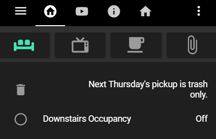

# Home Assistant Swipe Navigation

[](https://github.com/hacs/integration)  

Swipe through Home Assistant Dashboard views on mobile.



This repository has been forked from [maykar/lovelace-swipe-navigation](https://github.com/maykar/lovelace-swipe-navigation) to continue the development since the original project is currently unmaintained.

💡 **Please uninstall [maykar/lovelace-swipe-navigation](https://github.com/maykar/lovelace-swipe-navigation) before proceeding, as it will conflict with this plugin.**

## Features:
* Animated swiping through Dashboard views
* Configure views to skip over
* Set the swipe length needed
* Option to disable browsers default swipe actions.
* Option to wrap from first view to last view and vice versa
* Supports RTL languages
* Correctly ignores swipes over certain elements (e.g. sliders or maps)

## Installation:
**Follow only one of these installation methods.**

<details>
  <summary><b>Installation and tracking with HACS (recommended):</b></summary>

[](https://my.home-assistant.io/redirect/hacs_repository/?owner=zanna-37&repository=hass-swipe-navigation&category=plugin)

1. Open the badge above to jump straight to this repository in HACS.
   Alternatively, open HACS from the Home Assistant sidebar and search for `Swipe Navigation`: the entry is listed as _Home Assistant Swipe Navigation_.

2. On the repository page, select _Download_ in the bottom right corner.
   HACS adds the dashboard resource automatically; if your dashboards are in YAML mode, the dialog shows the resource entry to add by hand instead.

3. Confirm when HACS asks to reload the browser.
</details>

<details>
  <summary><b>Manual installation:</b></summary>
  
1. Copy [swipe-navigation.js](https://github.com/zanna-37/hass-swipe-navigation/releases/latest) from the latest release into `/www/hass-swipe-navigation/`

2. Add the resource in _Settings_ → _Dashboards_ → _More Options icon_ → _Resources_ → _Add resource_ → Set _URL_ as the path below → Set _Resource type_ as `JavaScript module`.

```yaml
# Increase the version number (`v=x.y.z`) at end of the URL after each update
url: /local/hass-swipe-navigation/swipe-navigation.js?v=1.0.0
type: module
```

3. Refresh the page, may need to clear cache.
</details>

## Config:
**If you just want to use the default config values you don't need to add a config at all.**

If you want to modify the configuration, place it in the root of your dashboard configuration under the `swipe_nav` element (see example below).

**Config Options:**

| Name               |  Type   | Default | Description                                                                                                                                                                  |
|--------------------|:-------:|:-------:|------------------------------------------------------------------------------------------------------------------------------------------------------------------------------|
| animate            | string  | `none`  | Swipe animations. Can be: `none`, `swipe`, `fade`, `flip`. The swipe animation should be considered experimental and depending on your setup may appear buggy.               |
| animate_duration   | number  |  `200`  | Swipe animation's duration in milliseconds.                                                                                                                                  |
| enable             | boolean | `true`  | Enable or disable the swipe navigation.                                                                                                                                      |
| enable_mouse_swipe | boolean | `false` | Enable or disable the swipe navigation via mouse.                                                                                                                            |
| enable_on_subviews | boolean | `true`  | Enables swipe navigation while on subviews. <br>⚠️ _Note the difference between this and `skip_subviews`, which skips over subviews while navigating **from** regular views._ |
| logger_level       | string  | `warn`  | Set logging level. Possible values are: `verbose`, `debug`, `info`, `warn`, `error`.                                                                                         |
| prevent_default    | boolean | `false` | Prevent the browsers default horizontal swipe actions.                                                                                                                       |
| skip_subviews      | boolean | `true`  | Automatically skip subviews.                                                                                                                                                 |
| skip_tabs          | string  |         | A comma separated list of views to skip when swiping. e.g., `1,3,5`.<br>⚠️ _Note that tabs count starts at `0`, so the first is `0`, second is `1`, and so on._               |
| swipe_amount       | number  |  `15`   | Minimum percent of screen needed to be swiped in order to navigate.                                                                                                          |
| wrap               | boolean | `true`  | Wrap from first tab to last tab and vice versa.                                                                                                                              |
| ~~skip_hidden~~    | boolean | `true`  | Automatically skip hidden tabs.<br>⚠️ _Setting this to `false` is deprecated and poses a security risk as it allows a user to reveal a tab they don't have access to._        |
| indicator          | boolean | `false` | Show the bottom slide indicator (dots).                                                                                                                                      |
| indicator_duration | number  | `1500`  | How long (ms) the indicator remains visible after the swipe ends. Should be at least animate_duration + indicator_resync_buffer to avoid flickering.                         |
| indicator_resync_buffer | number | `50` | Extra buffer (ms) added to `animate_duration` before the indicator resyncs after a swipe. Increase on slower devices/themes to avoid flicker.                              |


**Example:**

Don't just copy the example, it won't fit your needs. Build your own using the config options above.

```yaml
# You don't necessarily need a configuration.
# Add only the options that differ from the default values.
swipe_nav:
  wrap: false
  enable_mouse_swipe: true
  animate: swipe
  skip_tabs: 5,6,7,8
  prevent_default: true
  swipe_amount: 30
  
views:
```

If you need help, Mark Watt has an excellent video covering the configuration [in this youtube video](https://www.youtube.com/watch?v=03IPN9lBEfE&t=663s).

## Contributions
If you want to help, put a ⭐ to the repository and open issues or pull requests to contribute to the development.

### For developers
Have a look to the [CONTRIBUTING](./CONTRIBUTING.md) file.

## Thank you
Big thanks to:
* [@maykar](https://github.com/maykar) The original author of this project.

## Star History
[](https://star-history.com/#zanna-37/hass-swipe-navigation&Date)
